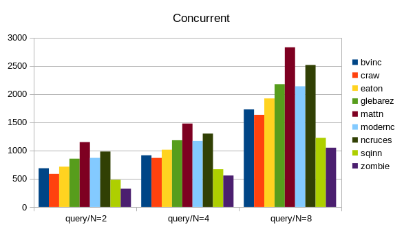

Benchmarks for Golang SQLite Drivers
==============================================================================

This work is sponsored by Monibot - Easy Server and Application Monitoring.
Try out Monibot at [https://monibot.io](https://monibot.io?ref=go-sqlite-bench).
It's free.

For benchmarks I used the following libraries:

- craw, `crawshaw.io/sqlite`, a CGO-based solution. This is not a `database/sql` driver.

- eaton, `github.com/eatonphil/gosqlite`, a CGO-based solution. This is not a
    `database/sql` driver. (addded by @c4rlo)

- mattn, `github.com/mattn/go-sqlite3`, a CGO-based solution. This library is
    (still) the de-facto standard and widely used. 

- modernc, `modernc.org/sqlite`, a pure Go solution. This is a newer library,
    based on the SQLite C code re-written in Go.

- ncruces, `github.com/ncruces/go-sqlite3`, a pure Go solution based on WASM (?). 

- sqinn, `github.com/cvilsmeier/sqinn-go`, a solution without CGO. It uses
    `github.com/cvilsmeier/sqinn` to access SQLite database files.

- zombie, `github.com/zombiezen/go-sqlite`, a rewrite of the crawshaw driver, using the
    modernc libraries. This is not a `database/sql` driver.

The test setup is as follows:

- OS: Debian/GNU Linux amd64 version 12.4
- CPU: 11th Gen Intel(R) Core(TM) i7-1165G7 @ 2.80GHz, 4 physical cores, 8 logical cores
- RAM: 16GB
- Disk: 1TB NVME SSD
- go version go1.21.5 linux/amd64

The benchmark was run on 2024-01-07, with then-current library versions.
See go.mod for library versions. Each test was run once for warmup.
The second run was then recorded. This is not very scientific.

A general note on benchmarks:

Do not trust benchmarks, write your own. This specific benchmark is modelled
after my very own database usage scenarios. Your scenarios may be totally
different.

Database Schema
------------------------------------------------------------------------------

The test database consist of the following tables and indizes:

    PRAGMA journal_mode=DELETE;
    PRAGMA synchronous=FULL;
    PRAGMA foreign_keys=1;
    PRAGMA busy_timeout=5000;

    CREATE TABLE users (
        id INTEGER PRIMARY KEY NOT NULL,
        created INTEGER NOT NULL,
        email TEXT NOT NULL,
        active INTEGER NOT NULL);
    CREATE INDEX users_created ON users(created);

    CREATE TABLE articles (
        id INTEGER PRIMARY KEY NOT NULL,
        created INTEGER NOT NULL,  
        userId INTEGER NOT NULL REFERENCES users(id),
        text TEXT NOT NULL);
    CREATE INDEX articles_created ON articles(created);
    CREATE INDEX articles_userId ON articles(userId);

    CREATE TABLE comments (
        id INTEGER PRIMARY KEY NOT NULL,
        created INTEGER NOT NULL,
        articleId INTEGER NOT NULL REFERENCES articles(id),
        text TEXT NOT NULL);
    CREATE INDEX comments_created ON comments(created);
    CREATE INDEX comments_articleId ON comments(articleId);

Benchmarks
------------------------------------------------------------------------------

Result times are measured in milliseconds. Lower numbers indicate better
performance.

### Simple

Insert 1 million user rows in one database transaction.
Then query all users once.

    Simple;      insert;  query;
    craw;          1213;    560;
    eaton;         1165;    800;
    mattn;         1583;   1089;
    modernc;       5654;   1193;
    ncruces;       3331;    933;
    sqinn;          893;    615;
    zombie;        1885;    310;

### Complex

Insert 200 users in one database transaction.
Then insert 20000 articles (100 articles for each user) in another transaction.
Then insert 400000 comments (20 comments for each article) in another transaction.
Then query all users, articles and comments in one big JOIN statement.

    Complex;     insert;  query;
    craw;           720;    601;
    eaton;          706;    805;
    mattn;          905;   1213;
    modernc;       3114;   1510;
    ncruces;       1954;   1228;
    sqinn;          571;    713;
    zombie;        1359;    494;

### Many

Insert N users in one database transaction.
Then query all users 1000 times.
This benchmark is used to simluate a read-heavy use case.

    Many;        query/N=10; query/N=100; query/N=1000;
    craw;                13;          61;          480;
    eaton;               25;          80;          657;
    mattn;               32;         123;          996;
    modernc;             24;         128;         1074;
    ncruces;             40;         115;          876;
    sqinn;               19;          64;          577;
    zombie;              16;          35;          267;

### Large

Insert 10000 users with N bytes of row content.
Then query all users.
This benchmark is used to simluate reading of large (gigabytes) databases.

    Large;       query/N=50000; query/N=100000; query/N=200000;
    craw;                  197;            321;            716;
    eaton;                 201;            331;            577;
    mattn;                 159;            247;            486;
    modernc;               252;            668;           1187;
    ncruces;               179;            323;            587;
    sqinn;                 511;           1060;           2284;
    zombie;                185;            582;           1030;

### Concurrent

Insert one million users.
Then have N goroutines query all users.
This benchmark is used to simulate concurrent reads.

    Concurrent;  query/N=2; query/N=4; query/N=8;
    craw;              584;       963;      1692;
    eaton;             854;      1260;      2109;
    mattn;            1243;      1475;      2972;
    modernc;          2614;      7142;     18362;
    ncruces;          1043;      1444;      2676;
    sqinn;             660;      1349;      2287;
    zombie;            343;       694;      1121;

Summary
------------------------------------------------------------------------------

- We cannot declare a winner, it all depends on the use case.
- Crawshaw and Zombiezen are pretty fast.
- SQLite without CGO is possible.

This work is sponsored by Monibot - Easy Server and Application Monitoring.
Try out Monibot at [https://monibot.io](https://monibot.io?ref=go-sqlite-bench).
It's free.
